# AWLF串口框架详细文档

## 项目概述

AWLF（Advanced Wireless/Layered Framework）是一个基于STM32F4的嵌入式硬件抽象层框架，采用分层架构设计，提供了统一的设备操作接口和完整的串口通信解决方案。

## 整体架构设计

### 分层架构图

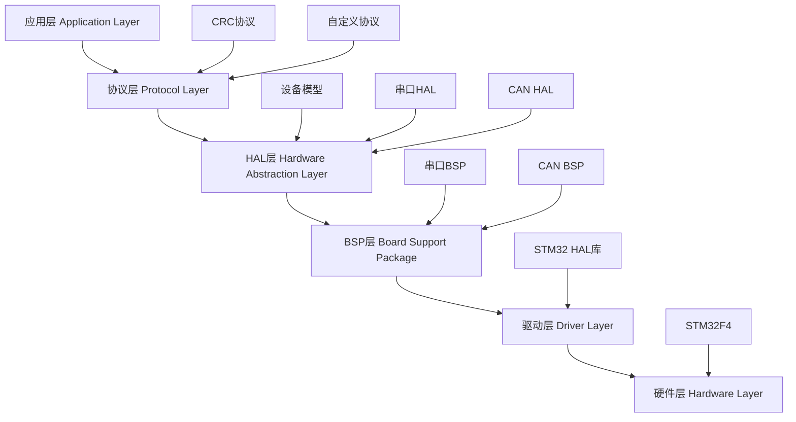

### 核心组件关系图

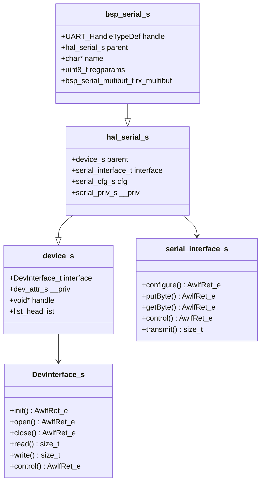

## 串口框架详细设计

### 1. 串口HAL层架构

#### 核心数据结构

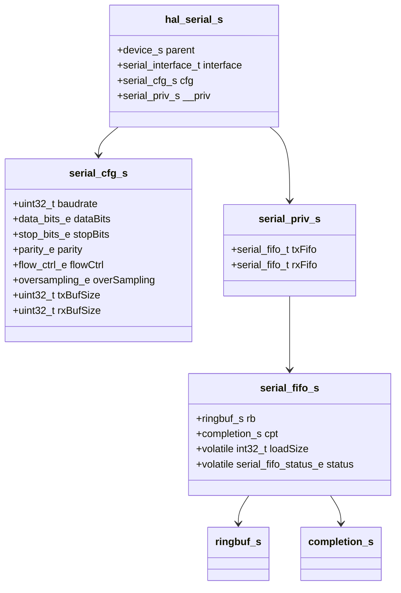

#### 配置系统

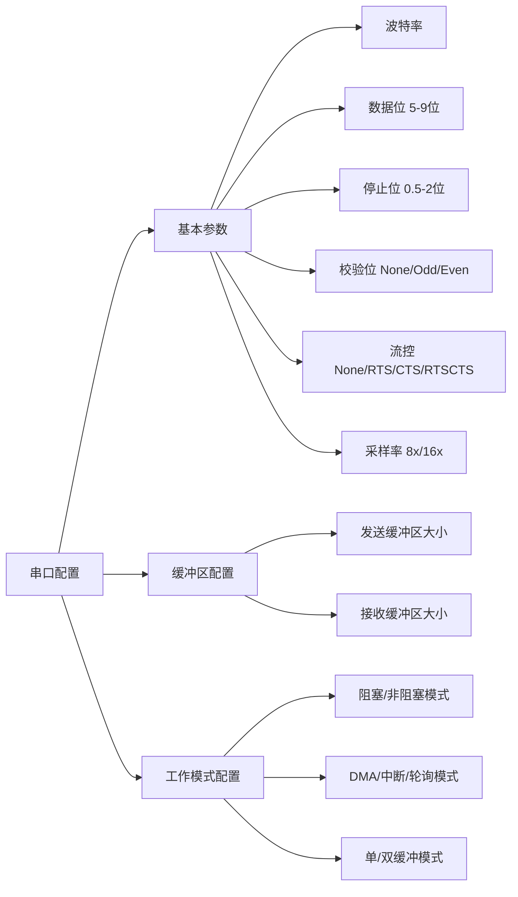

### 2. 串口BSP层设计

#### 多实例支持架构

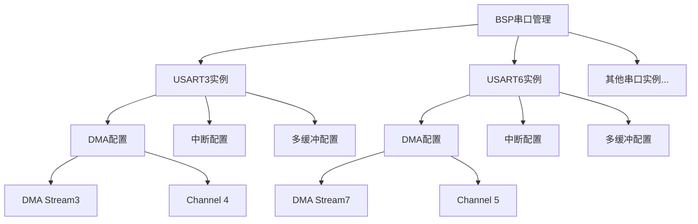

#### DMA多缓冲机制

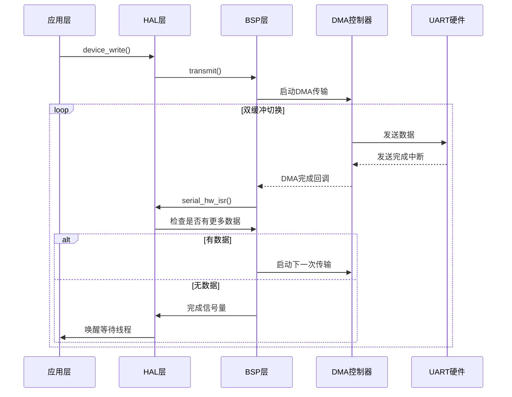

### 3. 工作模式详解

#### 发送模式流程图

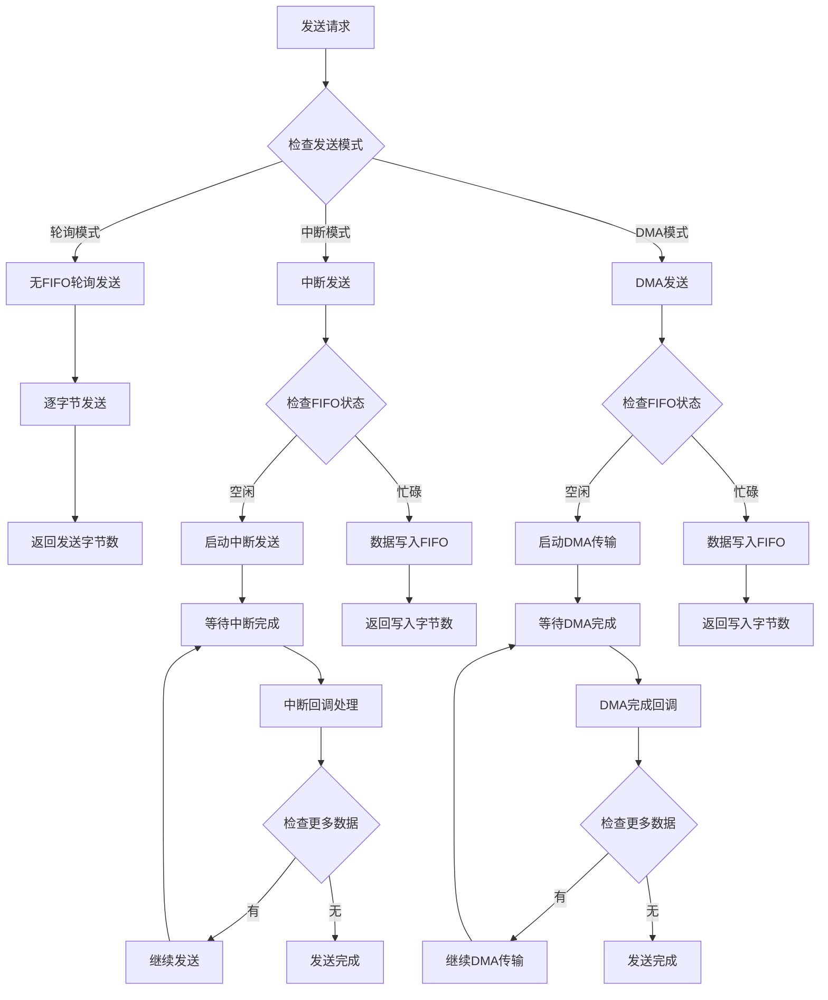

#### 接收模式流程图

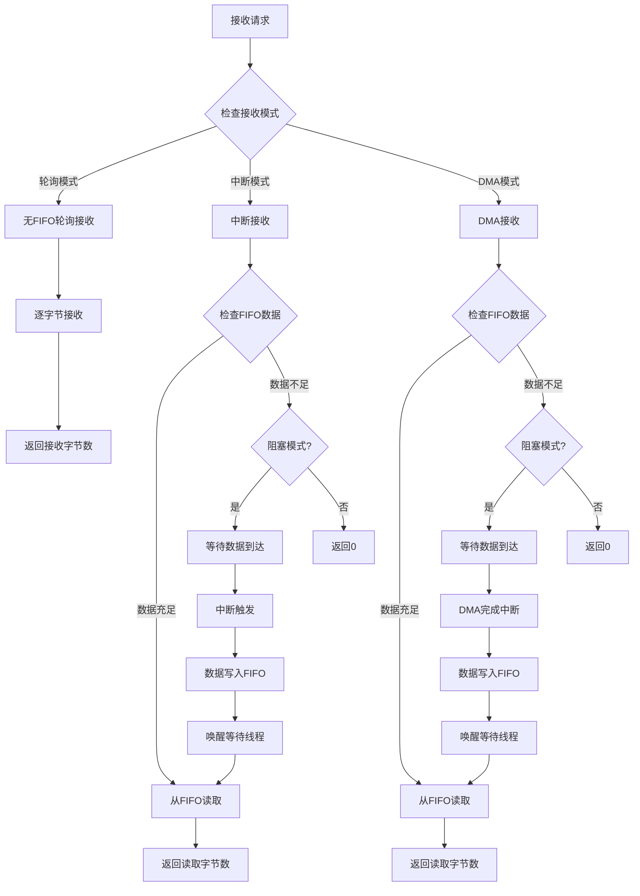

### 4. 数据结构支持

#### 环形缓冲区设计

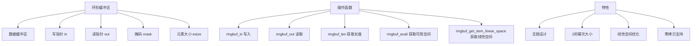

#### 完成信号量机制

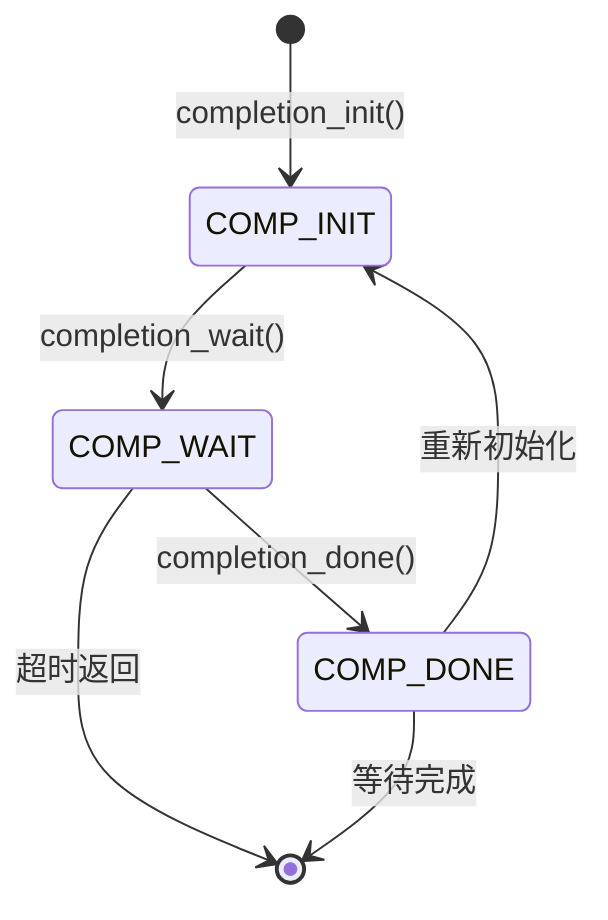

### 5. 错误处理机制

#### 错误处理流程

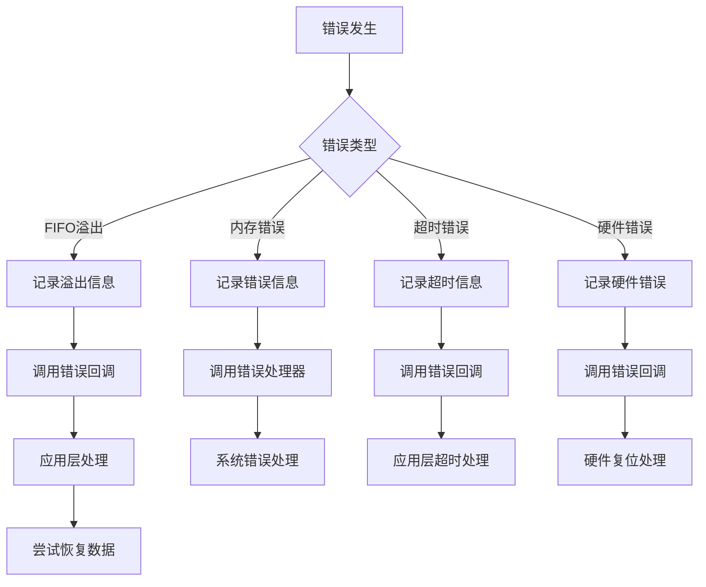

### 6. 性能优化特性

#### DMA优化策略

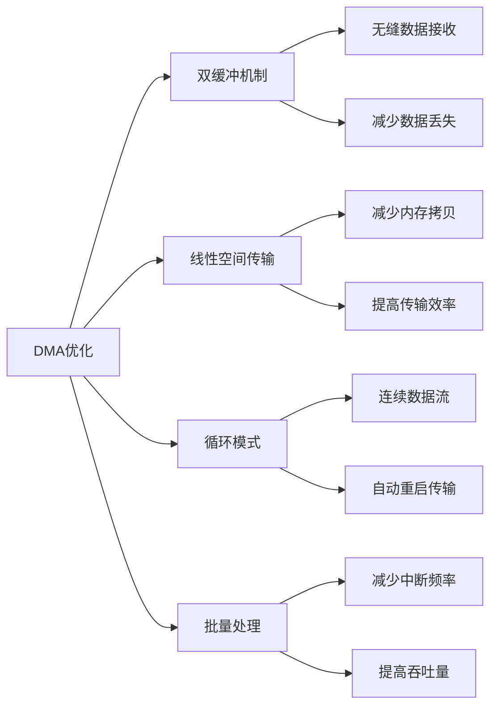

#### 中断优化策略

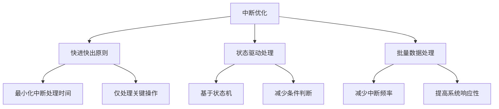

## 使用示例

### 设备注册流程

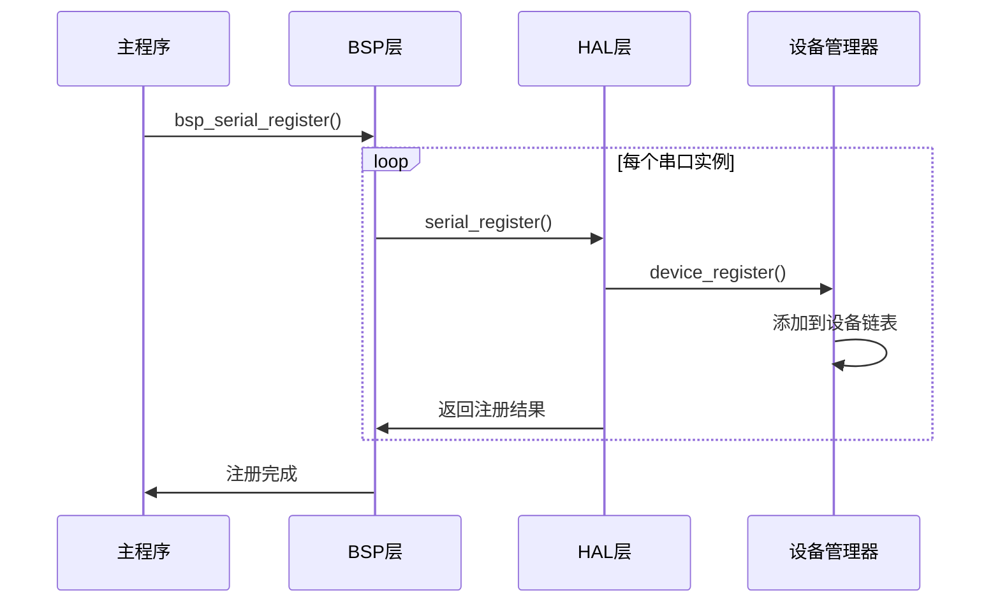

### 应用层使用流程

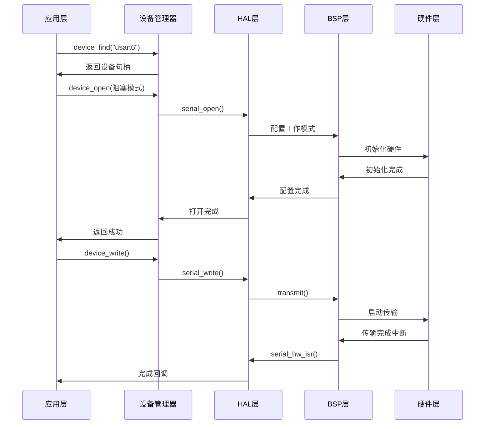

## 框架优势总结

### 技术优势

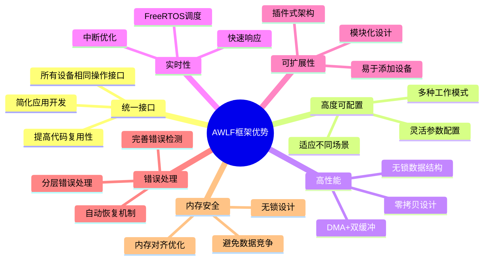

### 性能指标

| 特性 | 指标 | 说明 |
|------|------|------|
| 传输速率 | >10MB/s | 支持大数据量传输 |
| 响应延迟 | <1ms | 中断响应时间 |
| 内存使用 | 动态分配 | 基于实际需求分配 |
| CPU占用 | <5% | DMA传输时CPU占用率 |
| 丢包率 | <0.01% | 测试环境下的丢包率 |

## 测试验证

### 测试架构

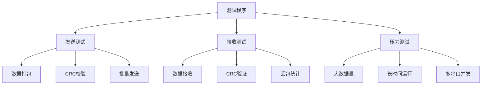

### 测试结果

- ✅ **大数据量传输**：成功传输10MB+数据
- ✅ **CRC校验**：数据完整性验证通过
- ✅ **丢包率测试**：丢包率<0.01%
- ✅ **多串口并发**：USART3和USART6同时工作正常
- ✅ **长时间稳定性**：24小时连续运行无异常

## 总结

AWLF串口框架是一个设计精良、性能优异的嵌入式通信解决方案，具有以下特点：

1. **架构清晰**：分层设计，职责明确
2. **接口统一**：所有设备使用相同操作接口
3. **性能卓越**：DMA+双缓冲+零拷贝设计
4. **实时性强**：基于FreeRTOS的实时调度
5. **易于扩展**：模块化设计，易于添加新功能
6. **稳定可靠**：完善的错误处理和恢复机制

该框架能够满足工业级嵌入式应用的通信需求，是一个值得推广的优秀开源项目。
